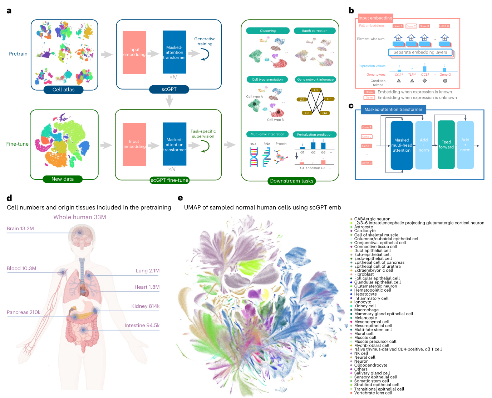
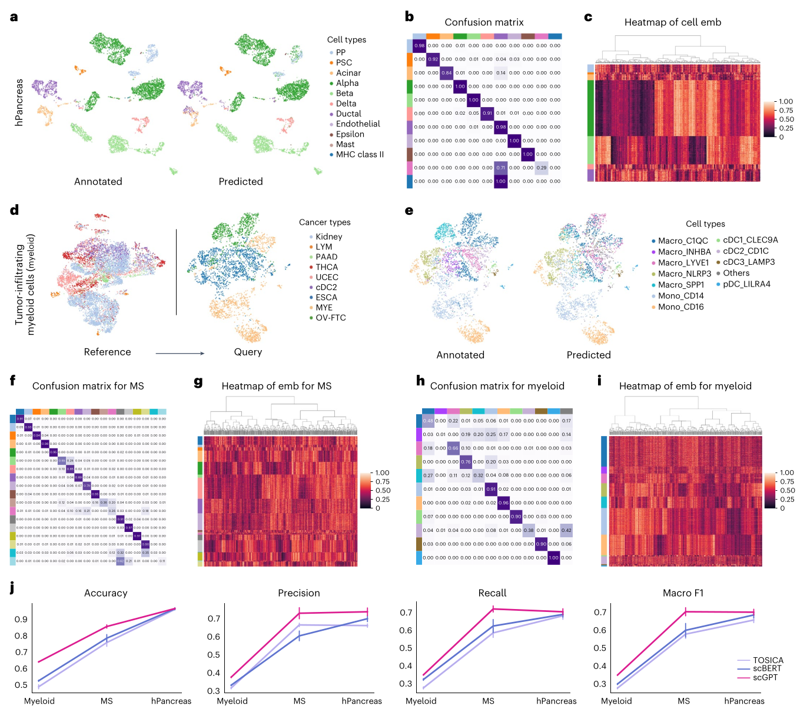
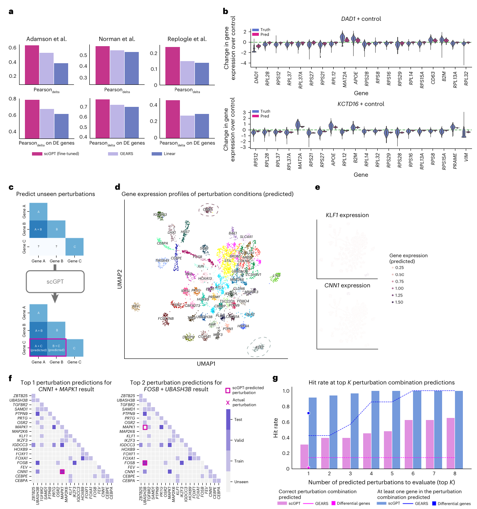
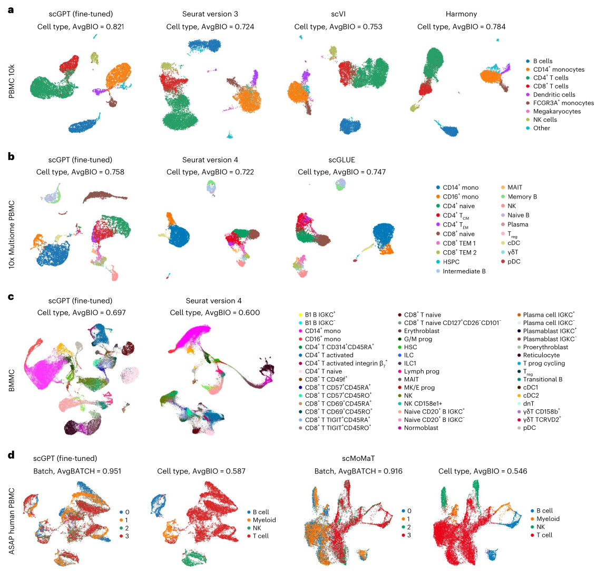
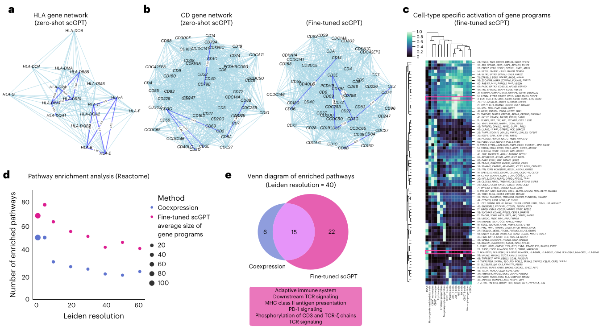
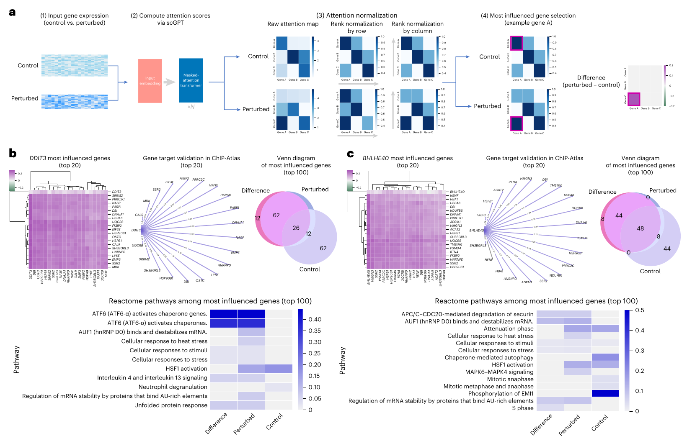

# scGPT: toward building a foundation model for single-cell multi-omics using generative AI

**Authors:** H. Cui et al.  
**Journal:** Nature Methods 21(8):1470-1480 (2024)

## Abstract

Generative pretrained models have achieved remarkable success in various domains such as language and computer vision. Specifically, the combination of large-scale diverse datasets and pretrained transformers has emerged as a promising approach for developing foundation models. Drawing parallels between language and cellular biology (in which texts comprise words; similarly, cells are defined by genes), our study probes the applicability of foundation models to advance cellular biology and genetic research. Using burgeoning single-cell sequencing data, we have constructed a foundation model for single-cell biology, scGPT, based on a generative pretrained transformer across a repository of over 33 million cells. Our findings illustrate that scGPT effectively distills critical biological insights concerning genes and cells. Through further adaptation of transfer learning, scGPT can be optimized to achieve superior performance across diverse downstream applications. This includes tasks such as cell type annotation, multi-batch integration, multi-omic integration, perturbation response prediction and gene network inference.
## Introduction

Single-cell RNA sequencing (scRNA-seq), by enabling intricate characterization of distinct cell types and advancing our understanding of disease pathogenesis, paves the way for cellular heterogeneity exploration, lineage tracking, pathogenic mechanism elucidation and, ultimately, personalized therapeutic strategies¹⁻⁴. The broad-scale application of scRNA-seq has led to comprehensive data atlases such as the Human Cell Atlas, which now encompasses tens of millions of cells⁵⁻⁷. Recent advancements in sequencing technology promote the diversity of data modalities and extend our understanding beyond genomics to epigenetics, transcriptomics and proteomics, thus providing multi-modal insights⁸⁹. These breakthroughs have also raised new research questions such as reference mapping, perturbation prediction and multi-omic integration¹⁰⁻¹⁴. It is critical to parallelly develop methodologies capable of effectively harnessing, enhancing and adapting to the rapid expansion of sequencing data.
One promising approach to address this challenge is the generative pretraining of foundation models¹⁵¹⁶. Foundation models, often built upon the self-attention transformer architecture¹⁷ for its effectiveness in learning expressive data representations, are a class of deep learning models that are pretrained on large-scale, diverse datasets and can be readily adapted for a variety of downstream tasks. Such models have recently achieved unprecedented success across various fields, exemplified by DALL-E 2 and GPT-4 in computer vision and natural language generation (NLG)¹⁸⁻²⁰ and recently Enformer²¹ for biological applications. More interestingly, these generative pretrained models consistently outperform task-specific models trained from scratch²²²³. This indicates a task-agnostic understanding of knowledge in these domains, inspiring us to explore its adoption for single-cell omic research. However, current machine-learning-based methods in single-cell research are rather scattered, with specific models dedicated to distinct analysis tasks²⁴⁻²⁶. As a result, the datasets used in each study are often limited in breadth and scale⁷. To confront this limitation, there is a need for a foundation model that is pretrained on large-scale data and can comprehend the complex interactions between genes across diverse tissues.
To enhance the modeling of large-scale single-cell sequencing data, we draw inspiration from the self-supervised pretraining workflow in NLG, in which the self-attention transformer¹⁷ has demonstrated great capability of modeling input tokens of words. While texts are made up of words, cells can be characterized by genes and the protein products they encode. By learning gene and cell embeddings simultaneously, we can better comprehend cellular characteristics. Moreover, the flexible nature of transformer input tokens enables easy incorporation of additional features and meta-information. This direction was also explored recently in Geneformer²⁷, in which transformer-based encoders are trained with genes ranked by expression levels and demonstrate abilities for cell type and gene function prediction. Advancing beyond this, we envision the need to tailor a pretraining workflow for directly modeling the intricacies of non-sequential omics data and to extend its applicability to a broader spectrum of tasks.

In this work, we present the single-cell foundation model scGPT by pretraining on over 33 million cells. We establish a unified generative pretraining workflow specifically for non-sequential omics data and adapt the transformer architecture to simultaneously learn cell and gene representations. Additionally, we provide fine-tuning pipelines with task-specific objectives, designed to facilitate application of the pretrained model across a range of diverse tasks.
Our model, scGPT, demonstrates the transformative potential of the single-cell foundation model through three key aspects. First, scGPT represents a large-scale generative foundation model that enables transfer learning across a diverse range of downstream tasks. By achieving state-of-the-art performance on cell type annotation, genetic perturbation prediction, batch correction and multi-omic integration, we showcase the effectiveness of the 'pretraining universally, fine-tuning on demand' approach as a generalist solution for computational applications in single-cell omics. Second, through the comparison of gene embeddings and attention weights between fine-tuned and raw pretrained models, scGPT uncovers valuable biological insights into gene–gene interactions specific to various conditions, such as cell types and perturbation states. Third, our observations reveal a scaling effect: larger pretraining data sizes yield superior pretrained embeddings and further lead to improved performance on downstream tasks. This finding highlights the exciting prospect that foundation models can continuously improve alongside the expansion of available sequencing data in the research community. Based on these findings, we envision that the adoption of pretrained foundation models will greatly expand our understanding of cellular biology and serve as a solid foundation for future discoveries. The release of the scGPT models and workflow aims to empower and expedite research in these areas and beyond.

## Results

### Single-cell transformer foundation model overview
Single-cell sequencing enables the profiling of molecular characteristics
at the individual cell level. For instance, scRNA-seq measures the abun-
dance of RNA transcripts, providing insights into cell identity, develop-
mental stage and functionality. We introduce scGPT, a foundation model
in the single-cell domain with a generative pretraining approach. The
core model contains stacked transformer layers with multi-head atten-
tion17 that generate cell and gene embeddings simultaneously (Meth-
ods). scGPT consists of two training stages: initial general-purpose
pretraining on large cell atlases and follow-up fine-tuning on smaller
datasets for specific applications (Fig. 1a–c). In the pretraining stage, we
introduce a specially designed attention mask and generative training
pipeline to train scGPT in a self-supervised manner to jointly optimize
cell and gene representations (Methods). This technique addresses the
non-sequential nature of gene expression to adapt to the NLG frame-
work of sequential prediction. During training, the model gradually
learns to generate gene expression of cells based on cell states or gene
expression cues. In the fine-tuning stage, the pretrained model can be
adapted to new datasets and specific tasks (Methods). We offer flexible
fine-tuning pipelines suitable for a variety of essential tasks in single-cell
research, including scRNA-seq integration with batch correction, cell
type annotation, multi-omic integration, perturbation prediction and
gene regulatory network (GRN) inference.
To collect diverse and extensive sequencing data for
self-supervised pretraining of scGPT, we assembled scRNA-seq data
from 33 million human cells under normal (non-disease) conditions,
obtained from the CELLxGENE collection (https://cellxgene.cziscience.
com/; Fig. 1d). This comprehensive dataset encompasses a wide range
of cell types from 51 organs or tissues and 441 studies, providing a rich
representation of cellular heterogeneity across the human body. After
pretraining, we visualized the scGPT cell embeddings on 10% of the
human cells of the 33 million cells using uniform manifold approxima-
tion and projection (UMAP) visualization28 (Fig. 1e). The resulting UMAP
plot exhibits intriguing clarity, with cell types accurately represented
by distinct colors at localized regions and clusters. Considering the
inclusion of over 400 studies in the dataset, this demonstrates the
remarkable capability of pretraining to distill biological variation.
scGPT improves the precision of cell type annotation
To fine-tune the pretrained scGPT for cell type annotation, a neural
network classifier takes the scGPT transformer output cell embedding
as input and outputs categorical predictions for cell types. The whole
model was trained with cross-entropy on a reference dataset with expert
annotations and then used to predict cell types on a held-out query data
partition. We conducted extensive experiments on diverse datasets to
evaluate the performance of scGPT for cell type annotation. First, we
adapted scGPT to predict cell types in a human pancreas dataset. We
visualized the predictions in Fig. 2a. Notably, scGPT achieved high preci-
sion (>0.8) for most cell types shown in the confusion matrix (Fig. 2b),
except only for rare cell types with extremely low cell numbers in the
reference partition. For example, fewer than 50 cells belong to mast
and major histocompatibility (MHC) class II cell types out of the 10,600
cells in the reference set. Fig. 2c visualizes the cell embeddings in the
fine-tuned scGPT, which demonstrate high intra-cell type similarities.
Next, we tested the model on a disease dataset of multiple sclerosis
(MS)29
. The model was fine-tuned on a reference partition of healthy
human immune cells and evaluated on the prediction for cells with
the MS condition. The fine-tuned model demonstrated strong align-
ment with the cell type annotations provided by the original study and
achieved a high accuracy of around 0.85 (Fig. 2f,g). Furthermore, we
applied the model to a more challenging scenario for generalization
across disease types using a tumor-infiltrating myeloid dataset30
. The
model was fine-tuned on six cancer types in a reference data parti-
tion (Methods) and evaluated on the query partition of three unseen
cancer types (Fig. 2d). The results demonstrated high precision in
distinguishing immune cell subtypes (Fig. 2e,h), and the cell embed-
dings exhibited clear separability among different cell types (Fig. 2i).
Finally, we benchmarked the fine-tuned scGPT against two other recent
transformer-based methods, TOSICA31 and scBERT32
, across the three
datasets (Methods). scGPT constantly outperformed the other meth-
ods in all classification metrics, including accuracy, precision, recall
and macro F1 (Fig. 2j).
In addition to cell type classification, we further explored the abil-
ity of scGPT to project unseen query cells to reference datasets through
reference mapping (Supplementary Note 1 and Supplementary Fig. 11).
We discovered that scGPT, with only pretrained weights, achieved
competitive performance compared with existing methods. Further
performance improvement can be achieved through fine-tuning on
reference datasets.
scGPT predicts unseen genetic perturbation responses
Recent advancements in sequencing and gene editing techniques have
greatly facilitated large-scale perturbation experiments, enabling the
characterization of cellular responses to various genetic perturbations.
This approach holds immense promise for uncovering new gene interac-
tions and advancing regenerative medicine. However, the vast combinato-
rial space of potential gene perturbations quickly surpasses the practical
limits of experimental feasibility. To overcome this limitation, scGPT can
be used to leverage the knowledge gained from cellular responses in
known experiments and extrapolate them to predict unknown responses.
The utilization of self-attention mechanisms over the gene dimension
enables encoding of intricate interactions between perturbed genes and
the responses of other genes. By leveraging this capability, scGPT can
effectively learn from existing experimental data and accurately predict
gene expression responses of unseen perturbations.Prediction of unseen gene perturbations. For the perturbation pre-
diction task, we evaluated our model using three Perturb-seq datasetsof leukemia cell lines: the Adamson dataset33 consisting of 87 one-gene
perturbations, the curated Replogle dataset34 consisting of 1,823
one-gene perturbations and the Norman dataset35 consisting of 131
two-gene perturbations and 105 one-gene perturbations. To assess
the perturbation prediction capability of scGPT, we fine-tuned the
model on a subset of perturbations to predict the perturbed expression
profile given an input control cell state and the genes of intervention.
Next, the model was tested on perturbations involving unseen genes
(Methods). We calculated the Pearsondelta metric, which measures
the correlation between predicted and observed post-perturbation
expression changes. Additionally, we reported this metric on the top
20 most significantly changed genes for each perturbation, denoted
as Pearsondelta on differentially expressed genes. See Supplementary
Note 12 for details on metric calculations. We conducted a performancecomparison between scGPT and two other methods, GEARS36 and a
linear regression baseline (Methods). Our results demonstrate that
scGPT achieved the highest scores for all three datasets (Fig. 3a and
Supplementary Table 6). Particularly, scGPT excelled in predicting
post-perturbation changes, consistently outperforming the others
by 5–20% margins. Additionally, we visualized predictions for two
example perturbations in the Adamson dataset in Fig. 3b, where scGPT
accurately predicted the trend of expression change for all top 20 dif-
ferentially expressed genes.The ability to predict unseen perturbation responses could expand
the scope of perturbation experiments, as depicted in Fig. 3c. To explore
the expanded space of predicted perturbation responses, we conducted
clustering analysis using the Norman dataset to validate biologically
relevant functional signals. The original Perturb-seq study covered 236
perturbations targeting 105 genes. However, considering all possible
combinations of these target genes, there are a total of 5,565 potential
perturbations, indicating that the experimental Perturb-seq data only
represent 5% of the entire perturbation space. Therefore, we applied thefine-tuned scGPT to expand the perturbation in silico and visualized the
predicted mean response for each perturbation in Fig. 3d using UMAP.
Using the annotations from the original study, we found that perturba-
tion conditions of the same functional groups clustered in neighboring
regions (Supplementary Fig. 4). Next, we clustered the predicted expres-
sion using Leiden37 and observed that the clusters exhibited high associa-
tion with the ‘dominant gene’ within the perturbation combinations. For
example, the circled cluster associated with the KLF1 gene indicated that
the data points in this cluster underwent combined perturbations involv-
ing KLF1 along with another gene (that is, KLF1 + X). Using the KLF1 and
CNN1 clusters as two examples, we further validated that the correspond-
ing predicted expression was exclusively high in these regions (Fig. 3e),
which aligns with expected outcomes of the CRISPRa (CRISPR-mediated
transcriptional activation) Perturb-seq experiments in the Norman data-
set. The dominant gene clusters demonstrate the capability of scGPT to
uncover associations between perturbation combinations.
In silico reverse perturbation prediction. scGPT is also capable of
predicting the source of genetic perturbation for a given resulting
cell state, which we refer to as in silico reverse perturbation predic-
tion. An ideal prediction model conducting such reverse prediction
can be used to infer important driving genes for lineage development
or to facilitate the discovery of potential therapeutic gene targets.
A hypothetical example application of such capability could be to
predict CRISPR target genes that influence cells to recover from a
disease state. To showcase the effectiveness of reverse perturbation
prediction, we used a subset of the Norman dataset focusing on pertur-
bations involving 20 genes (Fig. 3f). This combinatorial space consists
of a total of 210 one-gene or two-gene perturbation combinations.
We fine-tuned scGPT using 39 (18%) known perturbations (the train-
ing group in Fig. 3f). We then tested the model on queries of unseen
perturbed cell states, and scGPT successfully predicted the source of
perturbations (within top-ranked predictions) that would generate the
observed results. For example, scGPT ranked the correct perturbation
of CNN1 + MAPK1 genes as the top prediction for one test example, and
the correct perturbation of FOSB + UBASH3B genes was ranked as the
second prediction for another case (Fig. 3f). Overall, scGPT identified
on average 91.4% relevant perturbations (6.4 of seven) within the top 1
predictions (blue bars in Fig. 3g) and 65.7% correct perturbations (4.6 of
seven test cases) within the top 8 predictions (pink bars in Fig. 3g),
outperforming GEARS and the differential gene baseline by a con-
siderable margin. We envision that these predictions can be used for
planning perturbation experiments by maximizing the possibility
of deriving target cell states. Compared to random tryouts, which
would on average require 105.5 attempts of the 210 possible perturba-
tions in this subset, finding the correct source of genetic change with
fewer attempts offers a valuable tool for accelerating the discovery of
important genetic drivers and optimizing perturbation experiments.
scGPT enables multi-batch and multi-omic integration
Multi-batch scRNA-seq integration. Integrating multiple scRNA-seq
datasets from different batches poses unique challenges in simul-
taneously preserving the biological variance of integrated data and
removing technical batch effects. To integrate sequencing samples,
we fine-tuned scGPT in a self-supervised manner by learning unified
cell presentations that recover masked gene expression (Methods). In
our benchmarking experiments, we compared scGPT with three popu-
lar integration methods: scVI38, Seurat39 and Harmony40. The evalua-
tion was conducted on three integration datasets, namely, COVID-19
(18 batches)12, peripheral blood mononuclear cell (PBMC) 10k (two
batches)41 and perirhinal cortex (two batches)42 datasets. In the PBMC
10k dataset, scGPT successfully separated all cell types (Fig. 4a). The
superior integration performance of scGPT was further supported
by its high biological conservation score, with an AvgBIO score of
0.821, which was 5–10% higher than that of the compared methods.The AvgBIO score aggregates three cell type-clustering metrics, nor-
malized mutual information (NMIcell), adjusted Rand index (ARIcell) and
average silhouette width (ASWcell) as detailed in Supplementary Note 12.
Notably, scGPT also demonstrated considerable performance for inte-
grating the PBMC 10k dataset even without fine-tuning (Supplemen-
tary Fig. 5), highlighting the generalizability of the pretraining. In the
context of the perirhinal cortex dataset, scGPT remained competitive
against all other methodologies (Supplementary Fig. 6c). This finding
highlights the transferability and robustness of the features learned
from the whole-human dataset when applied to specific organs or
tissues such as the brain. Furthermore, scGPT consistently achieves
competitive scores across all integration metrics and demonstrates
strong conservation of biological signals (Supplementary Table 3
and Supplementary Figs. 6 and 7). Additionally, we have developed
strategies to accelerate the fine-tuning process for the integration
task, including freezing specific model layers and excluding genes
with no expression while maintaining results comparable to those of
our original approach (Supplementary Note 3).
Single-cell multi-omic integration. Single-cell multi-omic (scMulti-
omic) data, which combine multiple views of genetic regulation such as
epigenetic, transcriptomic and translation activities, present a unique
challenge in aggregating cell representations while preserving biologi-
cal signals8,9. scGPT addresses this challenge by effectively extracting
integrated cell embeddings across different omics datasets. In the
case of the 10x Multiome PBMC dataset43, which includes joint gene
expression and chromatin accessibility measurements, we compared
scGPT with two state-of-the-art methods, scGLUE13 and Seurat (v.4)44. As
depicted in Fig. 4b, scGPT stands out as the only method that success-
fully generates a distinct cluster for CD8+ naive cells. Next, we tested
scGPT on the paired gene expression and protein abundance dataset
from bone marrow mononuclear cells (BMMCs)45 as illustrated in Fig. 4c.
This dataset contains additional complexity from the large amount of
data (90,000 cells), multiple batches (12 donors) and fine-grained sub-
group annotations (48 cell types). scGPT presented more defined clus-
ter structures than Seurat (v.4), with a 9% improvement in the AvgBIO
score. Notably, scGPT was able to separate CD4+ naive T cells and CD4+
activated T cells as two distinct clusters. It also teased apart integrin β7+
activated CD4+ T cells from other CD4+ T cells, which further endorsed
the ability of the model to capture subtle differences between immune
cell subgroups. In the mosaic data-integration setting, sequenced sam-
ples share some, but not all, data modalities, posing a challenge for
integration methods. To showcase the capabilities of scGPT in this
context, we used the ATAC with select antigen profiling (ASAP) human
PBMC dataset46 as an example. This dataset consists of four sequenc-
ing batches with three data modalities. In the benchmark experiment
with scMoMat14, scGPT demonstrated superior batch correction per-
formance as shown in Fig. 4d, especially in groups of B, myeloid and
natural killer (NK) cells. Overall, scGPT demonstrates superior cell
type-clustering performance and exhibits robustness across diverse
benchmarked biological conservation metrics (Supplementary Table 4).
scGPT uncovers gene networks for specific cell states
The interactivity between transcription factors, cofactors, enhancers
and target genes underlying a GRN mediates important biological
processes. Existing GRN-inference methods often rely on correlation
in static gene expression or pseudo-time estimates as a proxy for causal
graphs47. scGPT, optimized by generative modeling of gene expression,
implicitly encodes such relationships in its gene embeddings as well
as in attention maps. We thus propose GRN-inference workflows by
probing the scGPT embeddings and attention maps from pretrained
or fine-tuned models. The gene embeddings construct a similarity
network that entails gene–gene interactions on the dataset level. Atten-
tion maps further capture unique gene network-activation patterns
across different cell states. In this study, we validate the gene network extracted by scGPT against known biology and explore its applicability
to gene program discovery.
scGPT demonstrates its ability to group functionally related genes
and differentiate functionally distinct genes via learned gene token
embeddings. In Fig. 5a, we conducted a sanity check by visualizing the
similarity network of human leukocyte antigen (HLA) proteins using
gene embeddings from the pretrained scGPT model. In this zero-shot
setting, the scGPT model successfully highlighted two clusters cor-
responding to the well-characterized HLA classes: HLA class I andHLA class II genes. These classes encode antigen-presenting proteins
that play different roles in immune contexts. For example, HLA class I
proteins (encoded by genes such as HLA-A, HLA-C and HLA-E) are rec-
ognized by CD8+ T cells and mediate cytotoxic effects, while HLA class
II proteins (encoded by HLA-DRB1, HLA-DRA and HLA-DPA1) are recog-
nized by CD4+ T cells and trigger broader helper functions48. In addi-
tion, we fine-tuned the scGPT model on the ‘immune human’ dataset
and explored the CD gene network specific to the immune cell types
present in this dataset. We used the same fine-tuning strategy as thatused for the integration task (Methods) for the purpose of GRN analysis.
The pretrained scGPT model successfully identified the group of genes
(CD3E, CD3D and CD3G) encoding the T3 complex for T cell activation
as well as CD79A and CD79B for B cell signaling and CD8A and CD8B as
co-receptors for HLA class I molecules49 (Fig. 5b). Furthermore, the
fine-tuned scGPT model highlighted the connection between CD36
and CD14 (Fig. 5b).
scGPT is able to uncover meaningful gene programs that exhibit
cell type-specific activation. Gene programs are subsequently selected
and clustered using gene embeddings from scGPT (Methods). In
Fig. 5c, we visualize gene programs extracted by the fine-tuned scGPT
model on highly variable genes (HVGs) in the immune human data-
set50 and their expression in different cell types. We observed that a
set of HLA class II genes was identified as group 2. Similarly, the CD3
genes involved in the T3 complex were identified as group 3, with the
highest expression present in T cells. To systematically validate the
extracted gene programs, we performed pathway enrichment analysis
against the Reactome database (https://reactome.org/) and identified
high-confidence ‘pathway hits’ using stringent multiple-testing cor-
rection (https://mathworld.wolfram.com/BonferroniCorrection.html
and Methods). In Fig. 5d, we compare the results obtained from scGPT
with those from the coexpression network. Notably, scGPT consistently
demonstrates a substantially higher number of enriched pathways
across all clustering resolutions. Furthermore, we examined similari-
ties and differences in the identified pathways between scGPT and the
coexpression network, as depicted in Fig. 5e. Both methods identified
15 common pathways, including those associated with the cell cycle
and the immune system. scGPT uniquely identified an additional 22
pathways, 14 of which were immune related. Notably, scGPT specifically
highlighted pathways related to the adaptive immune system, T cell receptor signaling, PD-1 signaling and MHC class II presentation. This
is concordant with the fact that adaptive immune populations exist in
the fine-tuning datasets. These findings demonstrate the superior abil-
ity of scGPT to capture intricate gene–gene connections and unravel
specific mechanisms within a broader biological context. The detailed
list of enriched pathways is provided in Supplementary Table 5.
In addition to dataset-level gene network inference using gene
embeddings, the scGPT attention mechanism enables it to capture
gene–gene interactions at the single-cell level. scGPT extracts cell
state-specific network-activation data by aggregating single-cell sig-
nals from attention maps. This provides insights into context-specific
gene regulatory interactions within individual cells, which may vary
across different cell states and conditions. For example, in a pertur-
bation experiment, scGPT examines changes in gene network acti-
vation before and after perturbation to infer which genes are most
influenced by each perturbed gene (Fig. 6a and the Methods). In the
Adamson CRISPR interference dataset33, scGPT identified the top 20
genes most influenced by repression of DDIT3 (encoding a transcrip-
tion factor), which were all found to be signaling targets of DDIT3 in
the ChIP-Atlas database51 (Fig. 6b). Moreover, scGPT captured distinct
pathway-activation patterns among the top 100 genes most influenced
by DDIT3 in control versus DDIT3-knockout settings. Notably, the ATF6
transcription factor pathway identified in the DDIT3-knockout setting
is known to mediate the unfolded protein response and regulates cell
apoptosis52,53. Similarly, in the case of BHLHE40 repression, 19 of the
top 20 most-influenced genes were found to be targets of this transcrip-
tion factor predicted by chromatin immunoprecipitation followed by
sequencing (ChIP–seq) (Fig. 6c). The pathway-activation profile high-
lighting DNA synthesis and mitosis reflects the role of the transcription
factor BHLHE40 in cell cycle regulation. These attention-based findings further validate the scGPT learned gene network on a cell state level,
providing additional interpretability to the model’s learned biology. Scaling and in-context effects in transfer learning
In previous sections, scGPT has demonstrated great potential via
fine-tuning in a transfer learning manner. We further confirmed the
benefits of using the foundation model by comparing it with similar
transformer models trained for each downstream task from scratch
without pretraining (denoted as scGPT (from scratch)). The results are
presented in Supplementary Tables 2–4, where the fine-tuned scGPT
consistently showcases performance gain for tasks such as integra-
tion and cell type annotation. Given the observed contributions of the
foundation model for downstream tasks, we are further interested in
exploring factors influencing the transfer learning process.
First, we delve into the relationship between pretraining data size
and the performance of fine-tuned models: For a certain analysis task,
how much improvement can be gained by adding further sequencing
data into atlases for pretraining? We pretrained a series of scGPT mod-
els of the same number of parameters but using different amounts of
data, from 30,000 to 33 million sequenced normal human cells. Sup-
plementary Fig. 13a illustrates the resulting performance of fine-tuning
on various applications using these different pretrained models. We
observed that the performance of fine-tuned models improved as
the amount of pretraining data increased (Supplementary Note 4). These results indicate a scaling effect, suggesting that greater pretrain-
ing data size leads to better pretrained embeddings and improved
performance on downstream tasks. Notably, our findings also align
with the scaling law reported in natural language models54, highlight-
ing the important role of data size in model performance. The crucial
role of pretraining data size in fine-tuning results points to a promising
future for pretrained models in the single-cell domain. As larger and
more diverse datasets become available, we can anticipate further
improvements in model performance, advancing our understanding
of cellular processes.
The second factor we explored is the influence of context-specific
pretraining. Here, in-context usage refers to an scGPT model that is
pretrained on specific cell types and then fine-tuned for a downstream
task on similar cell types. To explore the influence of this factor, we
pretrained seven organ-specific models on normal human cells from
individual major organs (Fig. 1d) and another model for pan-cancer
cells. We verified the efficacy of the pretraining by visualizing cell
embeddings of the pretraining data: the pan-cancer model cell embed-
dings accurately separated different cancer types (Supplementary
Fig. 2). The organ-specific models were able to reveal cell heteroge-
neity of the corresponding organs (Supplementary Fig. 3). Next, we
fine-tuned individual models on the COVID-19 dataset to examine the
influence of pretraining context. Our analysis revealed a clear correla-
tion between the relevance of the model’s context in pretraining and its subsequent performance for integrating data (Supplementary Fig. 8).
The top performers in data-integration tasks were models pretrained
on whole-human, blood and lung datasets, which closely aligns with
the cell types present in the COVID-19 dataset. Notably, even a brain
pretrained model, despite being trained on a substantial dataset of
13 million cells, trailed in performance by 8% compared to the blood
pretrained model with a similar dataset size. This emphasizes the
importance of aligning the cellular context in pretraining with the
target dataset for superior results in downstream tasks. While considering the cellular context is essential, the whole-human pretrained model emerges as a versatile and reliable option for a wide range of applications.

## Discussion
We introduce scGPT, a foundation model that harnesses the power of
pretrained transformers on a vast amount of single-cell data. Building
upon the success of self-supervised pretraining in language models,
we adopted a similar approach in the single-cell domain to unravel
complex biological interactions. The use of transformers in scGPT
enables simultaneous learning of gene and cell embeddings, which
facilitates the modeling of various aspects of cellular processes. By
leveraging the attention mechanism of transformers, scGPT captures
gene-to-gene interactions at the single-cell level, providing an addi-
tional layer of interpretability.
We demonstrated the benefits of pretraining with comprehensive
experiments in both zero-shot and fine-tuning settings. The pretrained
model showcases strong capabilities of extrapolating to unseen data-
sets, presenting meaningful clustering patterns in accordance with cell
types in zero-shot experiments. In addition, the learned gene networks
in scGPT exhibit strong alignment with known functional groups.
Furthermore, the pretrained model’s knowledge can be transferred to
multiple downstream tasks through fine-tuning. In a variety of tasks
such as cell type annotation, perturbation prediction and multi-batch
and multi-omic integration, the fine-tuned scGPT model consistently
outperforms models trained from scratch. This demonstrates the
value of the pretrained model to downstream tasks, enabling more
accurate and biologically meaningful analyses. Notably, the current
pretraining does not inherently mitigate batch effects, and thus the
model’s zero-shot performance could be constrained on datasets
with substantial technical variation. Evaluating the model is also
complex, given the frequent absence of definitive biological ground
truths and the variation in data quality (detailed in Supplementary
Note 10).
For future directions, we plan to pretrain on a larger-scale dataset
with more diversity, including multi-omic data, spatial omics and vari-
ous diseased conditions. It is also interesting to incorporate perturba-
tion and temporal data in the pretraining stage, enabling the model
to learn causal relationships and infer how genes and cells respond
to changes over time. We also aim to explore in-context instruction
learning for single-cell data. This involves developing techniques that
allow the pretrained model to understand and adapt to different tasks
and contexts in a zero-shot setting without the need for fine-tuning.
By enabling scGPT to grasp the nuances and specific requirements of
different analyses, we can enhance its usability and applicability in
a wide range of research scenarios. We envision that the pretraining
paradigm will be readily integrated into single-cell research and serve
as a foundation to leverage existing knowledge from the exponentially
growing cell atlases for new discoveries.

## Figures

### Figure 1: Model schematic

**Fig. 1** | Model schematic. a, The workflow of scGPT. The model is generatively pretrained on large-scale scRNA-seq data from cell atlases. The core component of scGPT contains stacked transformer blocks with specialized attention masks for generative training. For downstream applications, the pretrained model parameters can be fine-tuned on new data. We applied scGPT in a variety of tasks including cell type annotation, batch correction, multi-omic integration, genetic perturbation prediction and gene network inference.

b, Detailed view of the input data embeddings. The input contains three layers of information: gene tokens, expression values and condition tokens (modality, batch, perturbation conditions, etc.).

c, Detailed view of the scGPT transformer layer. We introduced a specially designed attention mask in the masked multi-head attention block to conduct generative pretraining on single-cell sequencing data. Norm represents the layer normalization operation.

d, Diagram illustrating the size of training data and the organs of origin. The scGPT whole-human model was pretrained on scRNA-seq data of 33 million (M) normal human cells. k, thousand.

e, UMAP visualization of the pretrained scGPT cell embeddings (emb; a random 10% subset), colored by major cell types. GABA, γ-aminobutyric acid.

### Figure 2: Cell type-annotation results using scGPT

**Fig. 2** | Cell type-annotation results using scGPT. a, UMAP of gene expression of cells from the human pancreas dataset, colored by the cell types annotated in the original study (left) and by the cell types predicted by the fine-tuned scGPT (right). PP, pancreatic polypeptide cell; PSC, pancreatic stellate cell.

b, The confusion matrix between predicted and annotated cell types in the human pancreas dataset.

c, Heatmap of 512-dimensional cell embeddings from scGPT in the human pancreas dataset.

d, UMAP visualization of the myeloid dataset, colored by cancer types. scGPT was fine-tuned on the reference partition (left) and evaluated on the query partition (right). These two data partitions contain distinct cancer types. cDC2, type 2 (CD1A+CD172A+) conventional dendritic cell; ESCA, esophageal carcinoma; LYM, lymphoma; MYE, myeloma; OV-FTC, ovarian or follicular thyroid carcinoma; PAAD, pancreatic adenocarcinoma; THCA, thyroid carcinoma; UCEC, uterine corpus endometrial carcinoma.

e, On the query partition, UMAP is colored by the cell types annotated in the original study (left) and by scGPT-predicted cell types.

f,h, Confusion matrices between predicted cell types and actual annotations for the MS and myeloid datasets, respectively.

g,i, Heatmaps showing 512-dimensional cell embeddings in scGPT for cells in the MS and myeloid datasets, respectively.

j, Evaluation of the cell-annotation performance of scGPT through n = 5 random train–validation splits on the myeloid, MS and human pancreas datasets. Performance metrics from the test sets are presented as mean values ± s.e.m.

### Figure 3: Prediction results for perturbation response and reverse perturbation

**Fig. 3** | Prediction results for perturbation response and reverse perturbation.

a, Comparison between scGPT and other perturbation prediction methods. Pearson correlation between predicted and actual gene expression changes is reported. The metric is computed for all genes and the top differentially expressed (DE) genes, respectively.

b, Two example perturbations in the Adamson test dataset, distribution of predicted (pred; n = 300 cells) and actual gene expression change (n = 405 cells for the perturbation of gene KCTD16 and n = 618 cells for the perturbation of gene DAD1) of the top 20 differentially expressed genes. The box denotes the interquartile range of expression change. The median is marked by the central line within each box. Whiskers extend to 1.5 times the interquartile range. Horizontal dashed lines represent the null baseline of gene expression changes.

c, Illustration diagram for predicting unseen perturbation responses using scGPT.

d, UMAP of predicted gene expression profiles of the perturbation conditions. The UMAP plot is colored by Leiden clusters and labeled with the dominant gene of each cluster.

e, Expression patterns of two selected perturbed genes (KLF1 and CNN1) over UMAP of perturbation conditions.

f, Visualization of possible perturbation combinations over the perturbation combination space of 20 genes. The grid is colored by experiment type (train, valid, test, unseen). All predicted perturbations are highlighted by square boxes, and the actual source perturbation is marked with a cross.

g, Top 1–8 accuracy by scGPT for correct and relevant predictions among the seven test cases, benchmarked against GEARS and the naive baseline of the top two differential genes. The relevant predictions (blue) indicate that at least one of the perturbed genes in the perturbation combination is found in the predictions. The hit rates of scGPT are represented by the bars, those of GEARS are shown by the lines, and differential genes (for top 1 predictions only) are represented by square markers.

### Figure 4: Results of multi-batch and multi-omic integration

**Fig. 4** | Results of multi-batch and multi-omic integration.

a, Benchmark of the fine-tuned scGPT on the PBMC 10k dataset for the cell type-clustering task. The UMAP plot of learned cell embeddings is colored by cell types.

b, Benchmark of the fine-tuned scGPT model with scGLUE¹³ and Seurat (v.4)⁴⁴ on the 10x Multiome PBMC⁴³ dataset (paired RNA and assay for transposase-accessible chromatin (ATAC) data) for the cell type-clustering task. γδT, gamma delta T cell; HSC, hematopoietic stem cell; HSPC, hematopoietic stem and progenitor cell; ILC, innate lymphoid cell; MAIT, mucosal-associated invariant T cell; mono, monocyte; pDC, plasmacytoid dendritic cell; TCM, central memory T cell; TEM, effector memory T cell; Treg, regulatory T cell.

c, Benchmark of the fine-tuned scGPT model with Seurat (v.4)⁴⁴ on the BMMC⁴⁵ dataset (paired RNA and protein data) for the cell type-clustering task. dnT, double negative T cell; G/M, granulocyte-macrophage; MK/E, megakaryocyte-erythroid; Prog, progenitor.

d, Benchmark of scGPT with scMoMat¹⁴ on the ASAP PBMC⁴⁶ dataset (mosaic RNA, ATAC and protein data) for batch correction and cell type-clustering tasks. UMAP plots of learned gene embeddings are colored by sequencing batch (left) and cell type (right).

### Figure 5: Analysis of gene token embeddings

**Fig. 5** | Analysis of gene token embeddings.

a, HLA gene network from zero-shot scGPT.

b, CD gene network from the zero-shot (that is, pretrained) and fine-tuned scGPT on the immune human dataset.

c, Cell type-specific activation among scGPT-extracted gene programs in the immune human dataset. Coloring indicates average gene expression. For gene programs containing more than 10 genes (indicated by an asterisk), the first 10 genes are shown for simplicity.

d, Pathway enrichment analysis of the gene programs extracted by scGPT and the coexpression network in the immune human dataset. The number of enriched pathways from scGPT gene programs was compared with that of the coexpression method at different Leiden resolutions.

e, Venn diagram comparing the overlap and differences between the enriched pathways identified by coexpression versus scGPT. Some example pathways unique to scGPT and specific to adaptive immune functions are highlighted in the text box. TCR, T cell receptor.

### Figure 6: Attention-based gene interaction analysis

**Fig. 6** | Attention-based gene interaction analysis.

a, Attention-based GRN-discovery workflow for perturbation data. Attention scores in control and perturbed cell states are obtained and ranked by row and column consecutively. Most influenced genes in the control, perturbed and difference settings are selected accordingly.

b, GRN analysis for DDIT3 repression. The gene connectivity heatmap presents post-perturbation changes in the network of the top 20 genes most influenced by DDIT3 repression. The gene target network graph showcases the top 20 genes validated in the ChIP-Atlas database, with ChIP–seq-predicted targets highlighted in purple. The Venn diagram compares overlaps and differences among the top 100 most-influenced gene sets identified in three selection settings (that is, control, perturbed and post-perturbation difference). The pathway heatmap showcases the difference in Reactome pathways identified from the top 100 most-influenced genes across these three selection settings. The color indicates how strongly each pathway is represented by the percentage of gene overlap.

c, GRN analysis for BHLHE40 repression, visualized in a similar manner.